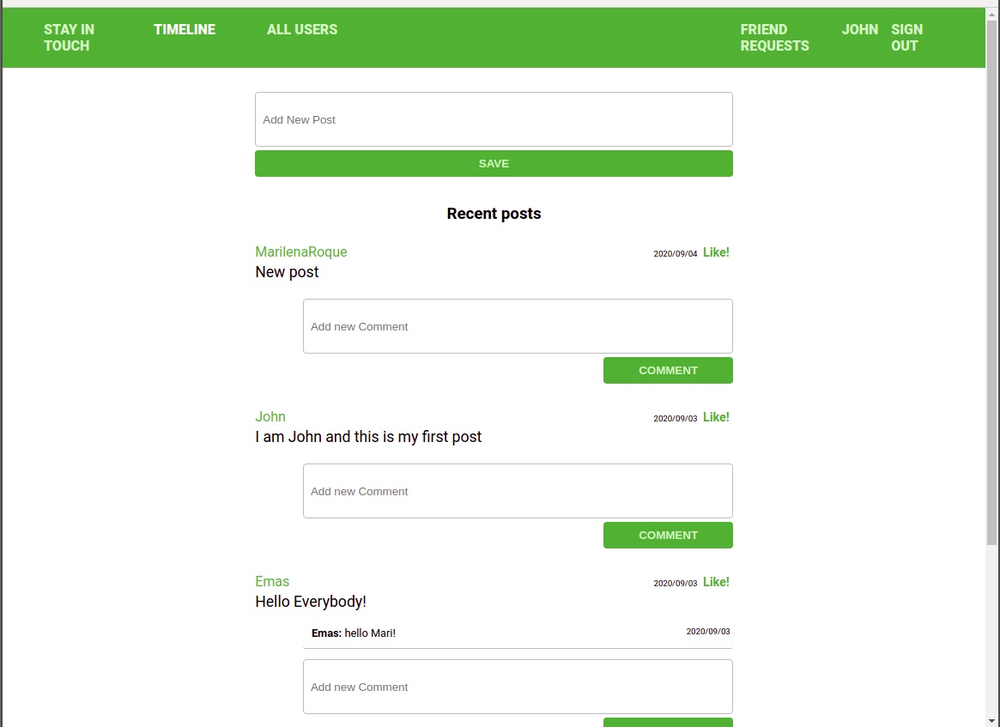

# Scaffold for social media app with Ruby on Rails

> On this project we forked a prepared repo by Microverse and built additional features to it. The main goal is to show mastering on built and work with many-to-many relationships inside one single table.

## Features Built

If you are an authenticated User, you can

- Send Friendship Request to another User
- Visit '/requests' page to check the requests received
- Accept or Reject Friendship requests
- See your posts and your friend's posts on your timeline
- In the list of users, you can see :
> - Pending Request for the users you sent a request and didn't receive an answer yet
> - Accept button for the users that sent you a request
> - Invite to Friendship button for others

## Built With

- Ruby v2.7.0
- Ruby on Rails v5.2.4
- PostgreSQL, '>= 0.18', '< 2.0'

## Milestones

# Milestone 1: Prepare data architecture documentation

- Create ERD to show the associations between users, comments, likes, posts, and friendships entities in the models and db.
  > Open 'docs/entity-relationship-diagram.png' file to see the ERD

# Milestone 1: Friendships

- Create a model with associations and all requested features for friendships.
- Built Integrations and Unit tests for the Friendship model.

### Prerequisites

Ruby: 2.6.3
Rails: 5.2.3
Postgres: >=9.5

## Getting Started

To get a local copy up and running follow these simple example steps.

- Clone this repository
- Open a terminal on the containing folder of this project

### Setup

- Run 'bundle install' to install the dependencies
- Set the database using the command 'bin/rake db:migrate'

### Usage

- Run the server using the command 'rails server'
- Access http://localhost:3000/ in your browser
- Use the navbar links to explore the features (make sure to create a user to have access to all features)

## Authors

👤 **Marilena Roque**

- Github: [MarilenaRoque](https://github.com/MarilenaRoque)
- Twitter: [@MariRoq88285995](https://twitter.com/MariRoq88285995)
- Linkedin: [roquemarilena](https://www.linkedin.com/in/roquemarilena/)

👤 **Emanuel González**

- Github: [@emasdev](https://github.com/emasdev)
- Twitter: [@elemasss](https://twitter.com/elemass)
- Linkedin: [@emasdev](https://www.linkedin.com/in/emasdev/)

TBA

## 🤝 Contributing

Contributions, issues and feature requests are welcome!

Feel free to check the [issues page](issues/).

## Show your support

Give a ⭐️ if you like this project!

## Acknowledgments

TBA

## 📝 License

TBA
